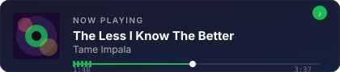

# Eshaan Saini.

CS @ Texas A&M &nbsp;·&nbsp; building things that actually help people

&nbsp;

&nbsp;

---

### S t a c k

  
  
  
  
  
  
  
  
  
  

---

### G i t H u b

  
  &nbsp;
  

---

### C u r r e n t l y  P l a y i n g

  

---

### W o r k s

| Project | Description | Stack |
|---|---|---|
| [Code Cartographer](https://github.com/eshaansaini2004/Code-Cartographer) | Codebase visualizer — maps structure and deps of any repo | Python |
| [PhishShield](https://github.com/eshaansaini2004/phish-shield-ext) | Chrome extension — real-time phishing detection with heuristics + threat intel | JavaScript |
| [Study Pilot](https://github.com/eshaansaini2004/Study-pilot) | AI-powered code analysis tool with project-scoped chatbot and batch analysis via Gemini | Python · Flask |
| [ShareTea POS](https://github.com/michtra/project3-team21-team-method) | Full-stack POS system, 5-member team, 90k+ DB entries, deployed on AWS | React · Node.js · AWS |
| [ThroughTheCookbook](https://github.com/eshaansaini2004/throughthecookbook1) | E-commerce platform for a small business with real-time order processing | React · Vercel |

---

  

